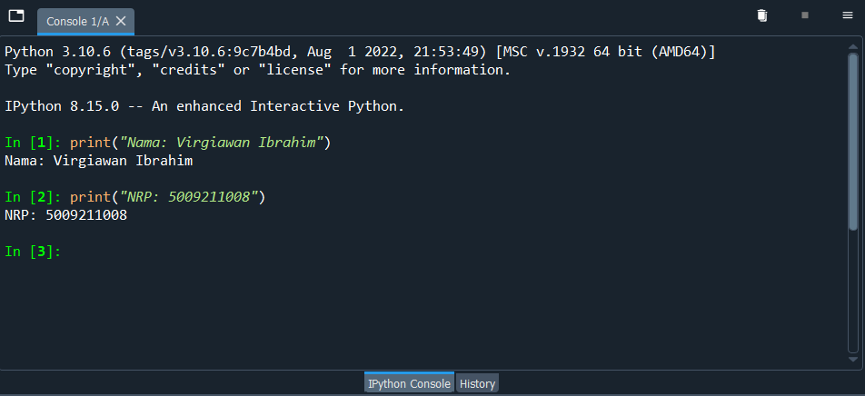
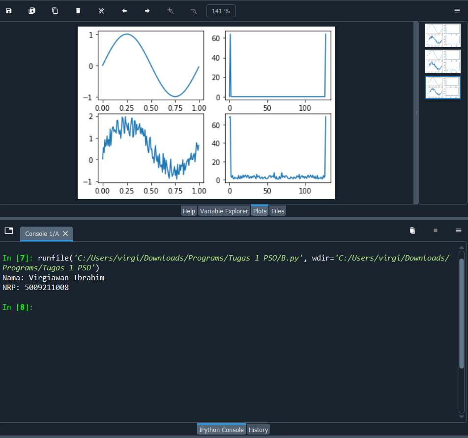
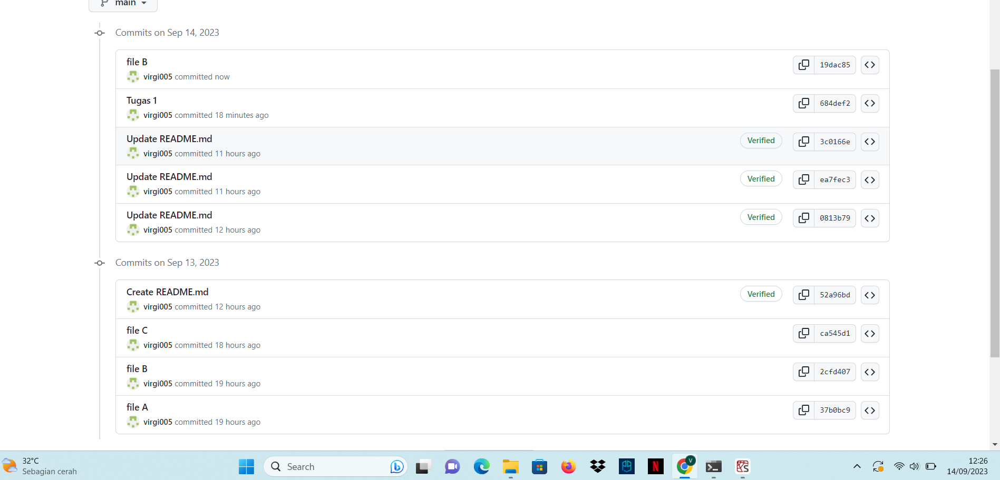
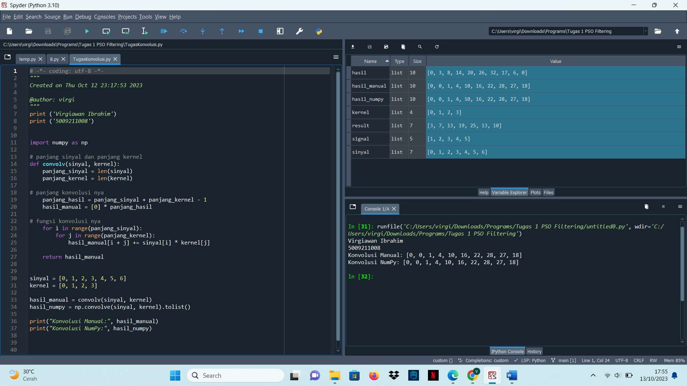
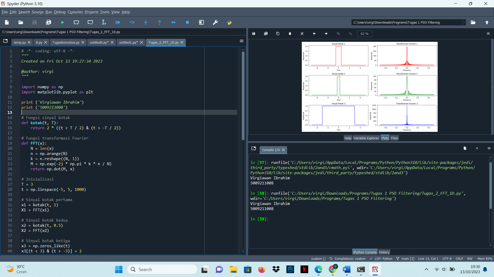
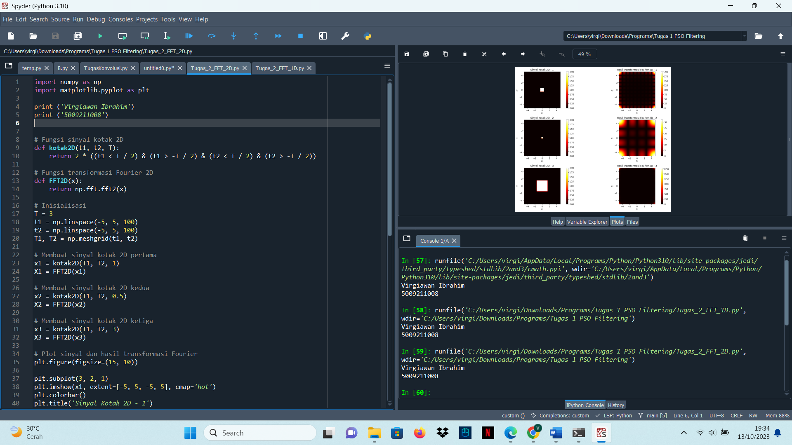

# tugas-Sinyal
**A. Membuat Nama dan NRP pada Spyder menggunakan python**
```python

print("Nama : Virgiawan Ibrahim")
print("NRP  : 5009211008")
```


**B. Membuat Contoh Grafik Sinus pada Spyder**

Berikut ini merupakan [Script-Code](B.py)



**C. Commit Logs**


**D. Implementasi Signal Processing**

Berikut ini merupakan [Script-Code](Filtering(tugas1).py)

.png)

# tugas-2-Sinyal
**Tugas Konvolusi**

Berikut ini merupakan [Script-Code](Tugas_2_Konvolusi.py)


**Tugas FFT 1D**

Berikut ini merupakan [Script-Code](Tugas_2_FFT_1D.py)



**Tugas FFT 2D**

Berikut ini merupakan [Script-Code](Tugas_2_FFT_2D.py)



